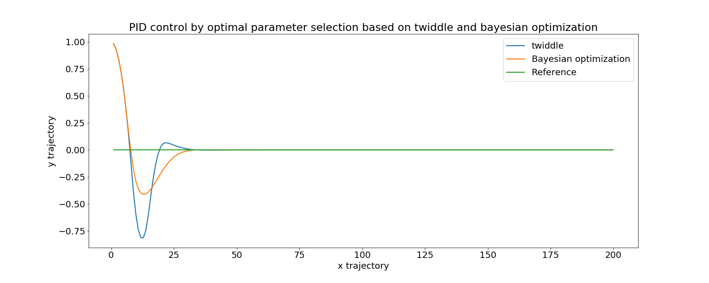

# Parameter optimization of PID control based on Twiddle algorithm and Bayesian Optimization

---

As inroduced in the lecture of PID control, the parameter can be selected by using twiddle algorithm. The basic idea is to twist each individual parameter by changing it increasingly or decreasingly according to the recorded loss value. 

Considering optimal parameter determination, Bayesian optimization also comes into my mind. Therefore, in this experiment, I make a comparison between the two parameter set obtained by twiddle algorithm and bayesian optimization. 

As shown below:

As we can see, the parameter selected by Bayesian optimization can make the robot avoid large trajectory variance, since the optimized trajectory of twiddle algorithm rapidly change around the reference. 

For more details, please have a look at the notebook.

